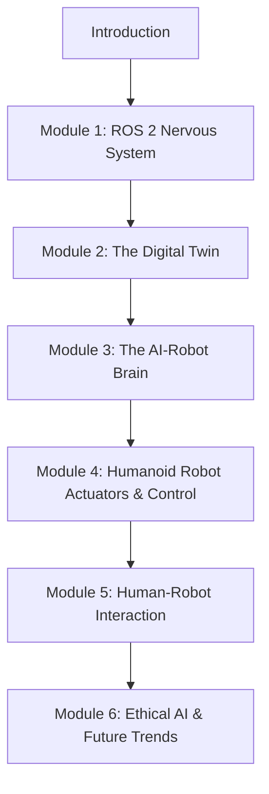

# 02 - Book Structure and Core Goal

## The Core Goal: Bridging the Digital Brain and the Physical Body

As introduced in the previous section, the overarching goal of this book is to thoroughly explore and demonstrate the methodologies, technologies, and challenges involved in **bridging the digital brain with the physical body** in the context of intelligent robotics. This signifies moving beyond purely theoretical AI to systems that can intelligently perceive, reason, and act within the complex and dynamic physical world. We aim to equip readers with the knowledge and practical skills necessary to develop such embodied AI systems, focusing on robust and adaptive physical interaction.

## Structure of the Book: Building a Humanoid AI

This book is organized into a series of modules, each focusing on a key aspect of building and understanding Physical AI and humanoid robots. The modules are designed to be progressive, building foundational knowledge before moving to more advanced topics.

### Book Modules Overview:

1.  **Module 1: ROS 2 Nervous System (Foundations of Robot Communication)**
    *   **Focus**: Introduction to ROS 2 as the inter-process communication backbone for robotics. Covers nodes, topics, services, and practical integration with Python-based AI agents.
    *   **Why it's essential**: ROS 2 provides the standardized framework for all robotic components to communicate and coordinate, forming the robot's "nervous system."
2.  **Module 2: The Digital Twin (Gazebo & Unity) (Virtual Prototyping and Simulation)**
    *   **Focus**: Creation and utilization of digital twins for robotics development. Covers photorealistic and physically accurate simulation environments using Gazebo and Unity, including sensor simulation and human-robot interaction in virtual space.
    *   **Why it's essential**: Simulation is crucial for safe, cost-effective, and rapid iteration during robot design, algorithm development, and synthetic data generation.
3.  **Module 3: The AI-Robot Brain (NVIDIA Isaac™) (Advanced Perception and Training)**
    *   **Focus**: Advanced AI capabilities for robotics using NVIDIA's Isaac Platform. Explores Isaac Sim for synthetic data generation, Isaac ROS for hardware-accelerated VSLAM and navigation, and Nav2 for sophisticated path planning, especially for bipedal humanoid movement.
    *   **Why it's essential**: Leverages GPU acceleration and state-of-the-art AI tools to give robots powerful perception and decision-making abilities.
4.  **Module 4: Humanoid Robot Actuators & Control (Bringing Robots to Life)**
    *   **Focus**: Understanding the mechanical and control aspects of humanoid robots. Covers advanced topics like inverse kinematics, dynamics, whole-body control, and balance for bipedal locomotion.
    *   **Why it's essential**: Translates high-level AI commands into stable, efficient, and dexterous physical movement.
5.  **Module 5: Human-Robot Interaction (Seamless Collaboration)**
    *   **Focus**: Principles and techniques for intuitive and safe collaboration between humans and robots. Explores verbal, gestural, and physical interaction modalities, crucial for humanoid robots in shared spaces.
    *   **Why it's essential**: Enables effective teamwork and acceptance of robots in human environments.
6.  **Module 6: Ethical AI & Future Trends in Robotics (Navigating the Future)**
    *   **Focus**: Addressing the ethical implications of advanced AI and humanoid robotics, discussing societal impact, regulatory challenges, and projecting future trends in the field.
    *   **Why it's essential**: Provides a critical perspective on the responsible development and deployment of intelligent physical systems.

## Progressive Learning Path

The book is designed to guide you through a logical progression:
*   **Foundations**: Starts with essential communication frameworks (ROS 2).
*   **Virtual Development**: Moves to safe and efficient development in simulation (Digital Twin).
*   **Intelligent Capabilities**: Introduces advanced AI for perception and navigation (AI-Robot Brain).
*   **Physical Manifestation**: Delves into the mechanics and control of humanoid robots (Actuators & Control).
*   **Societal Integration**: Explores interaction and ethical considerations (Human-Robot Interaction, Ethical AI).

## Conclusion

By following this structured approach, readers will gain a holistic understanding of Physical AI and humanoid robotics, from the foundational communication layers to advanced AI brains and the intricate control of the physical body. Each module is crafted to provide both theoretical insights and practical guidance, preparing you to contribute to the exciting future of embodied intelligence.