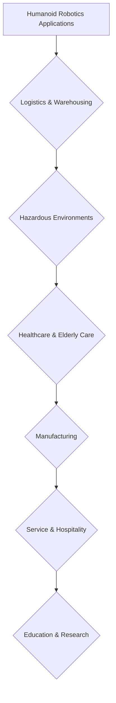

# 03 - Humanoid Robotics and Real-world Applications

## The Importance of Humanoid Robots in Human-Centered Environments

Humanoid robots, designed to mimic the human form, hold a unique and increasingly significant position in the field of Physical AI. Their importance stems from their inherent ability to seamlessly integrate into and operate within environments primarily designed for humans. This capability makes them ideal candidates for a vast array of applications where wheeled or other non-humanoid robots would face significant limitations.

### Key Advantages of Humanoid Robots:

*   **Navigating Human Environments**: Homes, offices, factories, and public spaces are structured for bipedal locomotion, staircases, and standard doorframes. Humanoid robots are naturally suited to traverse these spaces.
*   **Using Human Tools**: With human-like hands and dexterous manipulators, humanoids can utilize tools and interact with objects (e.g., door handles, machinery controls) designed for human use, without requiring specialized adaptations.
*   **Human-Robot Collaboration**: Their familiar form factor can facilitate more intuitive and natural interactions with humans, fostering trust and enabling seamless collaboration in shared workspaces or social settings.
*   **Versatile Manipulation**: The ability to reach, grasp, and manipulate objects with a wide range of dexterity allows them to perform complex tasks that require fine motor skills.
*   **Adaptability**: Humanoid robots are being designed to adapt to varied terrains and unexpected obstacles, leveraging their bipedal locomotion for stability and traversal.

## Real-world Applications of Physical AI with Humanoid Robots

The convergence of Physical AI and humanoid robotics is opening doors to a multitude of transformative applications:

*   **Logistics and Warehousing**: Humanoids are beginning to assist with tasks requiring complex manipulation and navigation within warehouses, such as picking items from shelves, organizing inventory, and operating specialized equipment.
*   **Hazardous Environments**: Deployment in disaster zones, nuclear facilities, deep-sea exploration, or space missions where human presence is too risky. They can perform inspection, maintenance, and rescue operations.
*   **Healthcare and Elderly Care**: Assisting nurses with patient lifting, delivering supplies, and providing companionship or therapeutic interactions for the elderly.
*   **Manufacturing**: Working collaboratively on assembly lines with human workers, handling delicate components or performing repetitive tasks that require human-like dexterity.
*   **Service and Hospitality**: Greeting customers, guiding visitors, and performing concierge services in hotels, retail stores, and airports.
*   **Education and Research**: Serving as advanced research platforms for studying locomotion, balance, learning, and human-robot interaction, as well as educational tools.

## Future Trends in Physical AI and Humanoid Robotics

The field is rapidly advancing, driven by breakthroughs in AI, materials science, and control systems. Key future trends include:

*   **Enhanced Dexterity and Manipulation**: Development of more sophisticated hands and grippers, coupled with advanced AI for fine motor control, allowing for unprecedented manipulation capabilities.
*   **Autonomous Learning in the Physical World**: Robots learning new skills and adapting to novel situations through self-supervised learning, reinforcement learning, and sim-to-real transfer, reducing the need for explicit programming.
*   **Robust Bipedal Locomotion**: Humanoids capable of navigating highly complex and dynamic terrains (e.g., rubble, uneven natural landscapes) with greater speed, efficiency, and robustness.
*   **Seamless Human-Robot Collaboration**: Robots that can anticipate human intentions, adapt their behavior to human cues, and engage in more natural and intuitive physical and social interactions.
*   **Energy Efficiency and Battery Life**: Innovations in lightweight materials, efficient actuators, and energy management systems to extend operational duration.
*   **Ethical AI and Societal Integration**: Increased focus on developing ethical guidelines, safety protocols, and public acceptance strategies for humanoid robots operating in shared human spaces.
*   **Cloud Robotics**: Leveraging cloud computing for heavy-duty computation, data storage, and fleet management of humanoid robots.

## Conclusion

Humanoid robotics, powered by advancements in Physical AI, stands at the cusp of revolutionizing how robots interact with and contribute to our world. Their human-like design makes them uniquely suited for integration into existing human infrastructures and for engaging in intuitive collaboration. As the technology matures, these robots will play an increasingly vital role in addressing complex challenges across industries and improving quality of life.