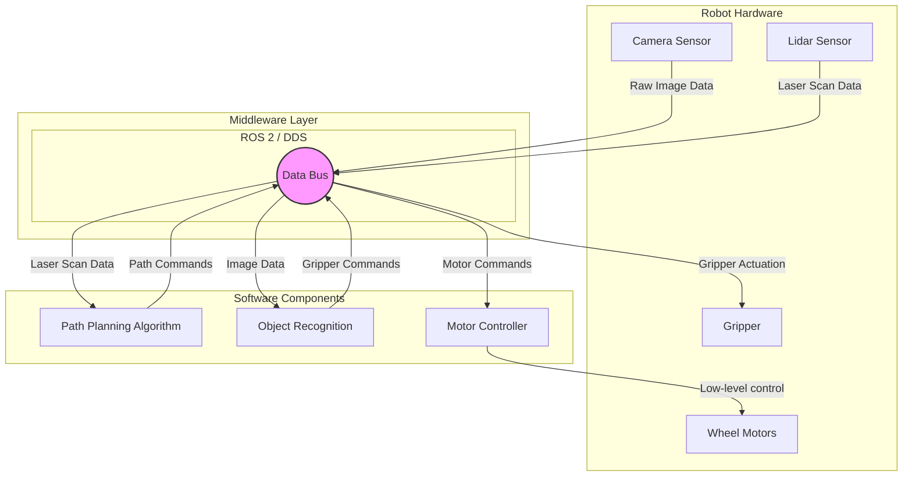

# 1. Introduction to ROS 2

Welcome to the first module of our journey into Physical AI. Here, we explore the "nervous system" of modern robots: the Robot Operating System (ROS). Specifically, we will focus on ROS 2, the next-generation platform for robotics development.

## What is Middleware?

Before diving into ROS 2, it's essential to understand the concept of **middleware**. In software engineering, middleware is software that provides services to applications beyond those available from the operating system. It acts as a "software glue," connecting different applications, systems, and components, and simplifying the development of distributed systems.

Think of it like the plumbing in a house. You don't need to know the intricate details of water pressure dynamics or pipe manufacturing to turn on a faucet. The plumbing system (middleware) handles the complex work of routing water from the source to the destination, allowing different fixtures (applications) to access it easily.

In robotics, a robot is a complex, distributed system composed of many parts:
-   **Sensors** (cameras, lidars, IMUs) that perceive the world.
-   **Actuators** (motors, grippers) that interact with the world.
-   **Computational units** that handle processing, planning, and decision-making.

These components need to communicate with each other reliably and efficiently. This is where middleware comes in.

## The Role of Middleware in Robotics

Robotics middleware provides a standardized communication layer that decouples software components. Instead of writing custom, low-level communication code for every pair of components, developers can rely on the middleware to handle:

-   **Message Passing**: Sending data between different processes, potentially on different machines.
-   **Hardware Abstraction**: Providing a common interface to interact with a wide variety of sensors and actuators.
-   **Service Discovery**: Automatically discovering and connecting to other components on the network.
-   **Data Serialization**: Packaging data into a format that can be sent over a network and unpacked by the receiver.

By handling these complex tasks, middleware allows robotics engineers to focus on their primary goal: developing novel robot behaviors and capabilities.

## Why ROS 2?

ROS (Robot Operating System) has become the de facto standard for robotics middleware. ROS 2 is a complete redesign of the original ROS, built to address the needs of modern robotics, including:

-   **Multi-robot systems**: Designed for robust communication between multiple robots.
-   **Real-time control**: Supports real-time applications with more deterministic behavior.
-   **Unreliable networks**: Built on top of the Data Distribution Service (DDS) standard, making it more resilient to packet loss.
-   **Commercial and mission-critical applications**: Offers improved security, quality of service (QoS) settings, and is supported on a wider range of operating systems.

In the following sections, we will explore the core building blocks of ROS 2 that make all of this possible (Open Robotics, n.d.).

### Middleware in Action: A Conceptual View

The diagram below illustrates how middleware simplifies communication within a robot. Instead of every component needing a direct connection to every other component, they all connect to the middleware layer, which handles the routing of data.

---
### References

Open Robotics. (n.d.). *Concepts*. ROS 2 Documentation. Retrieved December 7, 2025, from https://docs.ros.org/en/jazzy/Concepts.html
