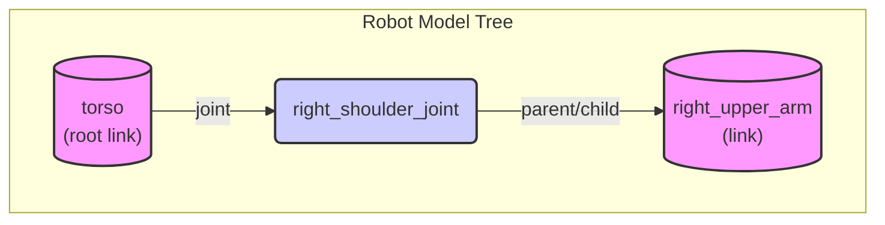

# 4. Understanding URDF for Humanoids

While ROS 2 provides the communication backbone for a robot's "nervous system," we also need a way to describe the robot's physical body. This is the role of the **Unified Robot Description Format (URDF)**.

URDF is an XML-based file format used in ROS to describe all the physical elements of a robot. Think of it as a blueprint that defines the robot's structure for the entire ROS 2 ecosystem.

## Why is URDF Important?

A URDF file allows various ROS 2 tools to understand your robot's geometry and kinematics. For example:
-   **Simulation**: Simulators like Gazebo use URDF to create a virtual model of your robot for testing algorithms without needing physical hardware.
-   **Visualization**: Tools like RViz2 parse URDF files to display a 3D model of the robot and its sensor data.
-   **Kinematics and Dynamics**: Libraries like the `robot_state_publisher` use the URDF to calculate the positions of all the robot's parts (forward kinematics) based on its joint angles.

For humanoid robots, which have many joints and complex structures, a well-defined URDF is absolutely critical.

## Core Components of a URDF

A URDF file describes a robot as a tree of **links** connected by **joints**.

### `<link>`
A link represents a rigid part of the robot's body. For a humanoid, a link could be the torso, an upper arm, a foot, or a finger segment. Each `<link>` element typically defines three key properties:
-   **`<visual>`**: What the link looks like. This includes its geometry (e.g., a box, cylinder, or mesh file) and its material (color or texture).
-   **`<collision>`**: The physical bounds of the link used for collision detection in a simulator. This is often a simplified version of the visual geometry for performance reasons.
-   **`<inertial>`**: The dynamic properties of the link, including its mass and inertia matrix. These are crucial for realistic physics simulation.

### `<joint>`
A joint connects two links together and defines how one link can move relative to the other.
-   **`parent` and `child`**: Every joint connects one `parent` link to one `child` link, forming the tree structure. There is always one root link that has no parent.
-   **`type`**: The type of motion the joint allows. Common types include:
    -   `revolute`: A hinge joint that rotates around a single axis (e.g., an elbow).
    -   `continuous`: A joint that can rotate infinitely (e.g., a wheel).
    -   `prismatic`: A sliding joint that moves along an axis (e.g., a piston).
    -   `fixed`: A rigid connection between two links that allows no movement.
-   **`axis`**: The axis of rotation or translation for `revolute` and `prismatic` joints.
-   **`origin`**: The position and orientation of the joint relative to the parent link's origin.

By combining links and joints, you can describe the entire kinematic chain of a robot, from its torso to its fingertips. In the next section, we'll look at a simple example.

## Simple Humanoid URDF Example

Below is a URDF for a simple humanoid consisting of a torso and a single arm. This example illustrates the parent-child relationship between links and the use of a revolute joint.

Save this code as `examples/simple_humanoid.urdf`.

```mdx-code-block
import CodeBlock from '@theme/CodeBlock';
import SimpleHumanoid from '!!raw-loader!./examples/simple_humanoid.urdf';

<CodeBlock language="xml" title="examples/simple_humanoid.urdf">
  {SimpleHumanoid}
</CodeBlock>
```

### Breakdown of the Example

-   **`<link name="torso">`**: This is the **root link** of our robot model.
-   **`<link name="right_upper_arm">`**: This is a child link.
-   **`<joint name="right_shoulder_joint">`**: This `revolute` joint connects the `torso` (parent) to the `right_upper_arm` (child). It allows rotation around the Y-axis (`<axis xyz="0 1 0" />`), simulating a shoulder's forward and backward swing.

This simple structure can be extended by adding more links (like a forearm and hand) and joints (like an elbow) to build a complete humanoid model.

### URDF Tree Structure

The URDF defines a robot model as a tree. For our `simple_humanoid` example, the tree is very simple:



The format and its capabilities are extensively documented and maintained by the ROS community (Open Robotics, n.d.).

---
### References

Open Robotics. (n.d.). *URDF*. ROS Wiki. Retrieved December 7, 2025, from http://wiki.ros.org/urdf

