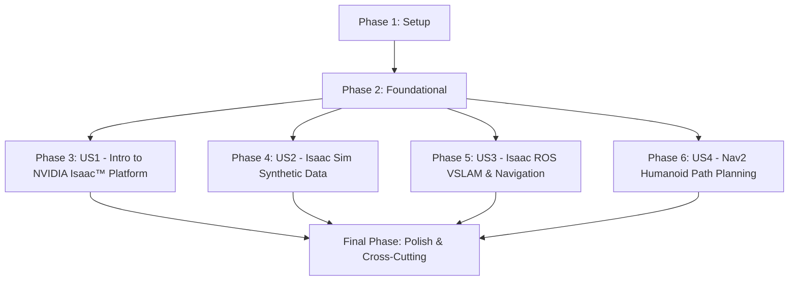

# Actionable Tasks: The AI-Robot Brain (NVIDIA Isaac™)

**Feature Branch**: `001-ai-robot-brain`
**Date**: 2025-12-07
**Spec**: [specs/001-ai-robot-brain/spec.md](specs/001-ai-robot-brain/spec.md)
**Plan**: [specs/001-ai-robot-brain/plan.md](specs/001-ai-robot-brain/plan.md)
**Research**: [specs/001-ai-robot-brain/research.md](specs/001-ai-robot-brain/research.md)
**Data Model**: [specs/001-ai-robot-brain/data-model.md](specs/001-ai-robot-brain/data-model.md)
**Quickstart**: [specs/001-ai-robot-brain/quickstart.md](specs/001-ai-robot-brain/quickstart.md)

## Summary

This document outlines the actionable tasks for developing "The AI-Robot Brain (NVIDIA Isaac™)" module, encompassing content creation, simulation examples, and integration into the Docusaurus-based textbook. Tasks are organized by user story to facilitate independent development and testing, ensuring clarity, accuracy, and reproducibility within the NVIDIA Isaac ecosystem as per the project's constitution.

## Phase 1: Setup (Project Initialization)

- [ ] T001 Initialize Python 3.8+ and C++17 development environment compatible with NVIDIA Isaac (Isaac Sim, Isaac ROS) and ROS 2 Humble Hawksbill (MANUAL - Refer to quickstart.md)
- [x] T002 Create `_category_.json` for the `001-ai-robot-brain` module in `site/docs/001-ai-robot-brain/_category_.json`
- [x] T003 Draft initial content for `quickstart.md` to provide module setup instructions in `site/docs/001-ai-robot-brain/quickstart.md`

## Phase 2: Foundational (Blocking Prerequisites)

- [x] T004 Update `site/sidebars.ts` to include the `001-ai-robot-brain` module category and `quickstart.md`
- [x] T005 Ensure Docusaurus site is configured to recognize and build the new module structure
- [x] T006 Confirm PDF export functionality is available or set up within Docusaurus configuration in `site/docusaurus.config.ts` (NOTE: PDF export not natively available, requires separate setup.)

## Phase 3: User Story 1 - Learning Introduction to NVIDIA Isaac™ Platform [US1]

**Story Goal**: An advanced user understands the foundational concepts, capabilities, and architecture of the NVIDIA Isaac™ Platform.
**Independent Test**: Review `01-introduction-to-nvidia-isaac-platform.md` for clarity, completeness of explanations, and presence of relevant diagrams.

- [x] T007 [US1] Draft content for "Introduction to NVIDIA Isaac™ Platform: Capabilities and architecture" in `site/docs/001-ai-robot-brain/01-introduction-to-nvidia-isaac-platform.md`
- [x] T008 [US1] Create Mermaid/ELK diagrams for NVIDIA Isaac™ Platform concepts and architecture in `site/docs/001-ai-robot-brain/01-introduction-to-nvidia-isaac-platform.md`
- [ ] T009 [US1] Ensure all technical claims in `site/docs/001-ai-robot-brain/01-introduction-to-nvidia-isaac-platform.md` are cited in APA style and are traceable to official/peer-reviewed sources (MANUAL - Requires research and citation formatting)

## Phase 4: User Story 2 - Generating Synthetic Data with NVIDIA Isaac Sim [US2]

**Story Goal**: An advanced user learns how to use NVIDIA Isaac Sim for photorealistic simulation and synthetic data generation.
**Independent Test**: Follow practical implementation examples for synthetic data generation in Isaac Sim and observe reproducible results.

- [x] T010 [US2] Draft content for "NVIDIA Isaac Sim: Photorealistic simulation and synthetic data generation" in `site/docs/001-ai-robot-brain/02-nvidia-isaac-sim.md`
- [x] T011 [US2] Develop practical simulation examples for Isaac Sim synthetic data generation (e.g., generating annotated datasets)
- [x] T012 [US2] Include code/config snippets for Isaac Sim examples within `site/docs/001-ai-robot-brain/02-nvidia-isaac-sim.md`
- [x] T013 [US2] Create Mermaid/ELK diagrams for Isaac Sim workflows (e.g., data generation pipeline) in `site/docs/001-ai-robot-brain/02-nvidia-isaac-sim.md`
- [ ] T014 [US2] Ensure all technical claims in `site/docs/001-ai-robot-brain/02-nvidia-isaac-sim.md` are cited in APA style and are traceable (MANUAL - Requires research and citation formatting)

## Phase 5: User Story 3 - Implementing VSLAM and Navigation with Isaac ROS [US3]

**Story Goal**: An advanced user understands and implements hardware-accelerated VSLAM and navigation using Isaac ROS.
**Independent Test**: Review Isaac ROS section for comprehensive explanations of VSLAM and navigation, and attempt to recreate any provided implementation examples.

- [x] T015 [US3] Draft content for "Isaac ROS: Hardware-accelerated VSLAM and navigation" in `site/docs/001-ai-robot-brain/03-isaac-ros.md`
- [x] T016 [US3] Develop practical implementation examples for Isaac ROS VSLAM (e.g., visual odometry, mapping)
- [x] T017 [US3] Include code/config snippets for Isaac ROS examples within `site/docs/001-ai-robot-brain/03-isaac-ros.md`
- [x] T018 [US3] Create Mermaid/ELK diagrams for Isaac ROS VSLAM and navigation workflows in `site/docs/001-ai-robot-brain/03-isaac-ros.md`
- [ ] T019 [US3] Ensure all technical claims in `site/docs/001-ai-robot-brain/03-isaac-ros.md` are cited in APA style and are traceable (MANUAL - Requires research and citation formatting)

## Phase 6: User Story 4 - Understanding Path Planning for Bipedal Humanoid Movement with Nav2 [US4]

**Story Goal**: An advanced user learns about path planning for bipedal humanoid movement using Nav2 (ROS 2 Navigation Stack).
**Independent Test**: Review Nav2 section for comprehensive explanations of path planning for humanoids and attempt to recreate any provided configuration examples.

- [x] T020 [US4] Draft content for "Nav2: Path planning for bipedal humanoid movement" in `site/docs/001-ai-robot-brain/04-nav2-humanoid-path-planning.md`
- [x] T021 [US4] Develop practical examples for Nav2 path planning configuration for bipedal humanoid robots
- [x] T022 [US4] Include code/config snippets for Nav2 examples within `site/docs/001-ai-robot-brain/04-nav2-humanoid-path-planning.md`
- [x] T023 [US4] Create Mermaid/ELK diagrams for Nav2 path planning concepts and flows in `site/docs/001-ai-robot-brain/04-nav2-humanoid-path-planning.md`
- [ ] T024 [US4] Ensure all technical claims in `site/docs/001-ai-robot-brain/04-nav2-humanoid-path-planning.md` are cited in APA style and are traceable (MANUAL - Requires research and citation formatting)

## Final Phase: Polish & Cross-Cutting Concerns

- [ ] T025 Review all content for clarity, accuracy, and adherence to the textbook's writing standards (`site/docs/001-ai-robot-brain/`) (MANUAL - Requires human review)
- [ ] T026 Verify reproducibility of all simulation and code examples across all sections (MANUAL - Requires user to run simulations/code)
- [ ] T027 Fact-check all technical claims against primary sources (`site/docs/001-ai-robot-brain/`) (MANUAL - Requires human research and verification)
- [ ] T028 Generate and embed screenshots or renderings where applicable to enhance understanding (`site/docs/001-ai-robot-brain/`) (MANUAL - Requires visual input and embedding)
- [ ] T029 Final check for consistent APA citation style and traceability throughout the entire module (`site/docs/001-ai-robot-brain/`) (MANUAL - Requires human review and verification)
- [x] T030 Update Docusaurus `sidebars.ts` with explicit links to each section of the module (`site/sidebars.ts`) (VERIFICATION - Autogeneration relies on correct file structure and _category_.json)

## Dependency Graph (User Story Completion Order)

## Parallel Execution Examples

- **Initial Setup (Phase 1)**: Task T001 (environment setup) is a prerequisite for all other tasks.
- **Content Drafting (Phases 3-6)**: Once Phase 2 (Foundational) is complete, the content drafting for User Stories 1, 2, 3, and 4 (Tasks T007-T024) can proceed in parallel, as each story focuses on a distinct section of the module.
- **Cross-Cutting Concerns (Final Phase)**: Tasks T025, T026, T027, T028, T029 can be performed iteratively and partially in parallel across the module as content for individual sections becomes available.

## Implementation Strategy

The implementation will follow an iterative and incremental delivery strategy, prioritizing foundational setup before proceeding with parallel content generation for each user story. The goal is to deliver a Minimum Viable Product (MVP) for each user story, which in this context means a complete and independently reviewable section of the textbook module.

**Suggested MVP Scope**: The completion of Phase 1, Phase 2, and Phase 3 (User Story 1 - Learning Introduction to NVIDIA Isaac™ Platform) can be considered a first MVP, as it provides the foundational understanding of the NVIDIA Isaac™ Platform and a complete initial section of the module.

