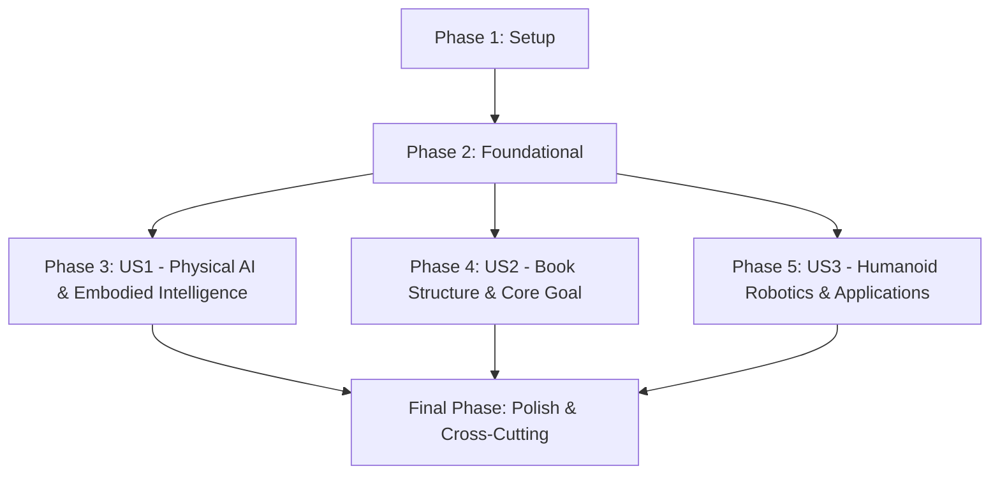

# Actionable Tasks: Introduction: Physical AI and Humanoid Robotics

**Feature Branch**: `001-book-introduction`
**Date**: 2025-12-07
**Spec**: [specs/001-book-introduction/spec.md](specs/001-book-introduction/spec.md)
**Plan**: [specs/001-book-introduction/plan.md](specs/001-book-introduction/plan.md)
**Research**: [specs/001-book-introduction/research.md](specs/001-book-introduction/research.md)
**Data Model**: [specs/001-book-introduction/data-model.md](specs/001-book-introduction/data-model.md)
**Quickstart**: [specs/001-book-introduction/quickstart.md](specs/001-book-introduction/quickstart.md)

## Summary

This document outlines the actionable tasks for developing the "Introduction: Physical AI and Humanoid Robotics" module, encompassing content creation, diagram generation, and integration into the Docusaurus-based textbook. Tasks are organized by user story to facilitate independent development and review, ensuring clarity, accuracy, and adherence to content standards as per the project's constitution.

## Phase 1: Setup (Project Initialization)

- [x] T001 Create `_category_.json` for the `001-book-introduction` module in `site/docs/001-book-introduction/_category_.json`
- [x] T002 Draft initial content for `quickstart.md` to provide book overview and navigation instructions in `site/docs/001-book-introduction/quickstart.md`

## Phase 2: Foundational (Blocking Prerequisites)

- [x] T003 Update `site/sidebars.ts` to include the `001-book-introduction` module category and `quickstart.md`
- [x] T004 Ensure Docusaurus site is configured to recognize and build the new module structure
- [x] T005 Confirm PDF export functionality is available or set up within Docusaurus configuration in `site/docusaurus.config.ts` (NOTE: PDF export not natively available, requires separate setup.)

## Phase 3: User Story 1 - Understanding Physical AI and Embodied Intelligence [US1]

**Story Goal**: A student or professional understands what Physical AI and embodied intelligence are, and their significance in robotics.
**Independent Test**: Review `01-physical-ai-embodied-intelligence.md` for clear definitions and context.

- [x] T006 [US1] Draft content defining Physical AI and embodied intelligence, highlighting their significance, in `site/docs/001-book-introduction/01-physical-ai-embodied-intelligence.md`
- [x] T007 [US1] Create Mermaid/ELK diagrams for Physical AI and embodied intelligence concepts in `site/docs/001-book-introduction/01-physical-ai-embodied-intelligence.md`
- [ ] T008 [US1] Ensure all definitions and claims in `site/docs/001-book-introduction/01-physical-ai-embodied-intelligence.md` are traceable to peer-reviewed articles or reputable sources and cited in APA style (MANUAL - Requires research and citation formatting)

## Phase 4: User Story 2 - Grasping the Book's Structure and Core Goal [US2]

**Story Goal**: A reader understands the overarching goal of the book and how its modules are structured.
**Independent Test**: Verify that the book's core goal is clearly stated and an accurate overview of each module is provided in `02-book-structure-core-goal.md`.

- [x] T009 [US2] Draft content explaining the core goal (bridging digital brain and physical body) and describing the book's structure with module overviews in `site/docs/001-book-introduction/02-book-structure-core-goal.md`
- [x] T010 [US2] Create Mermaid/ELK diagrams visualizing the book’s overall structure and module relationships in `site/docs/001-book-introduction/02-book-structure-core-goal.md`
- [ ] T011 [US2] Ensure all claims and module summaries in `site/docs/001-book-introduction/02-book-structure-core-goal.md` are traceable to reliable sources and cited in APA style (MANUAL - Requires research and citation formatting)

## Phase 5: User Story 3 - Exploring Humanoid Robotics and Real-world Applications [US3]

**Story Goal**: A reader is interested in the practical relevance of Physical AI and humanoid robotics, including real-world applications and future trends.
**Independent Test**: Check `03-humanoid-robotics-applications.md` for emphasis on humanoid importance, and inclusion of relevant real-world applications and future trends.

- [x] T012 [US3] Draft content emphasizing the importance of humanoid robots, including real-world applications and future trends in Physical AI, in `site/docs/001-book-introduction/03-humanoid-robotics-applications.md`
- [x] T013 [US3] Create Mermaid/ELK diagrams for humanoid robotics applications or future trends in `site/docs/001-book-introduction/03-humanoid-robotics-applications.md`
- [ ] T014 [US3] Ensure all claims about humanoid robotics, applications, and trends in `site/docs/001-book-introduction/03-humanoid-robotics-applications.md` are traceable to reliable sources and cited in APA style (MANUAL - Requires research and citation formatting)

## Final Phase: Polish & Cross-Cutting Concerns

- [ ] T015 Review all content for clarity, accuracy, accessible language, and adherence to writing standards (`site/docs/001-book-introduction/`) (MANUAL - Requires human review)
- [ ] T016 Fact-check all claims against primary sources (`site/docs/001-book-introduction/`) (MANUAL - Requires human research and verification)
- [ ] T017 Generate and embed any missing diagrams or illustrations (`site/docs/001-book-introduction/`) (MANUAL - Requires visual input and embedding)
- [ ] T018 Final check for consistent APA citation style and traceability throughout the entire introduction (`site/docs/001-book-introduction/`) (MANUAL - Requires human review and verification)
- [x] T019 Update Docusaurus `sidebars.ts` with explicit links to the Introduction module (`site/sidebars.ts`) (VERIFICATION - Autogeneration relies on correct file structure and _category_.json)

## Dependency Graph (User Story Completion Order)

## Parallel Execution Examples

-   **Initial Setup (Phase 1)**: Tasks T001 and T002 (category.json and quickstart.md) can be executed in parallel.
-   **Content Drafting (Phases 3-5)**: Once Phase 2 (Foundational) is complete, the content drafting for User Stories 1, 2, and 3 (Tasks T006-T014) can proceed in parallel, as each story focuses on a distinct aspect of the Introduction.
-   **Cross-Cutting Concerns (Final Phase)**: Tasks T015, T016, T017, T018 can be performed iteratively and partially in parallel across the module as content for individual sections becomes available.

## Implementation Strategy

The implementation will follow an iterative and incremental delivery strategy, prioritizing foundational setup before proceeding with parallel content generation for each user story. The goal is to deliver a Minimum Viable Product (MVP) for each user story, which in this context means a complete and independently reviewable section of the textbook module.

**Suggested MVP Scope**: The completion of Phase 1, Phase 2, and Phase 3 (User Story 1 - Understanding Physical AI and Embodied Intelligence) can be considered a first MVP, as it provides the foundational definitions and a complete initial subsection of the Introduction.
