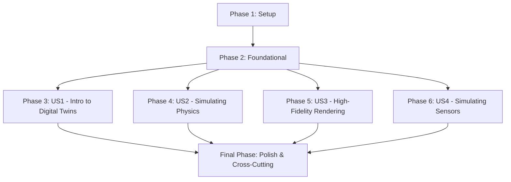

# Actionable Tasks: The Digital Twin (Gazebo & Unity)

**Feature Branch**: `001-digital-twin-sim`
**Date**: 2025-12-07
**Spec**: [specs/001-digital-twin-sim/spec.md](specs/001-digital-twin-sim/spec.md)
**Plan**: [specs/001-digital-twin-sim/plan.md](specs/001-digital-twin-sim/plan.md)
**Research**: [specs/001-digital-twin-sim/research.md](specs/001-digital-twin-sim/research.md)
**Data Model**: [specs/001-digital-twin-sim/data-model.md](specs/001-digital-twin-sim/data-model.md)
**Quickstart**: [specs/001-digital-twin-sim/quickstart.md](specs/001-digital-twin-sim/quickstart.md)

## Summary

This document outlines the actionable tasks for developing the "The Digital Twin (Gazebo & Unity)" module, encompassing content creation, simulation examples, and integration into the Docusaurus-based textbook. Tasks are organized by user story to facilitate independent development and testing, ensuring clarity, accuracy, and reproducibility as per the project's constitution.

## Phase 1: Setup (Project Initialization)

- [ ] T001 Initialize Python 3.8+ environment for ROS 2/Gazebo simulation examples (MANUAL - Refer to quickstart.md)
- [ ] T002 Initialize Unity environment for C# development and high-fidelity rendering examples (MANUAL - Refer to quickstart.md)
- [x] T003 Create `_category_.json` for the `001-digital-twin-sim` module in `site/docs/001-digital-twin-sim/_category_.json`
- [x] T004 Draft initial content for `quickstart.md` to provide module setup instructions in `site/docs/001-digital-twin-sim/quickstart.md`

## Phase 2: Foundational (Blocking Prerequisites)

- [x] T005 Update `site/sidebars.ts` to include the `001-digital-twin-sim` module category and `quickstart.md`
- [x] T006 Ensure Docusaurus site is configured to recognize and build the new module structure
- [x] T007 Confirm PDF export functionality is available or set up within Docusaurus configuration in `site/docusaurus.config.ts` (NOTE: PDF export not natively available, requires separate setup.)

## Phase 3: User Story 1 - Learning Introduction to Digital Twins in Robotics [US1]

**Story Goal**: A technical audience member understands the foundational concepts of Digital Twins in robotics.
**Independent Test**: Review `01-introduction-to-digital-twins.md` for clarity, completeness of definitions, and presence of relevant diagrams.

- [x] T008 [US1] Draft content for "Introduction to Digital Twins in Robotics" in `site/docs/001-digital-twin-sim/01-introduction-to-digital-twins.md`
- [x] T009 [US1] Create Mermaid/ELK diagrams for Digital Twin concepts in `site/docs/001-digital-twin-sim/01-introduction-to-digital-twins.md`
- [ ] T010 [US1] Ensure all technical claims in `site/docs/001-digital-twin-sim/01-introduction-to-digital-twins.md` are cited in APA style and are traceable to official/peer-reviewed sources (MANUAL - Requires research and citation formatting)

## Phase 4: User Story 2 - Simulating Physics in Gazebo [US2]

**Story Goal**: A technical audience member learns how to simulate physics, gravity, and collisions within the Gazebo environment.
**Independent Test**: Follow practical simulation examples in `02-simulating-physics-gazebo.md` and observe reproducible results.

- [x] T011 [US2] Draft content for "Simulating Physics, Gravity, and Collisions in Gazebo" in `site/docs/001-digital-twin-sim/02-simulating-physics-gazebo.md`
- [x] T012 [US2] Develop practical simulation examples for Gazebo physics (e.g., simple gravity, collision detection)
- [x] T013 [US2] Include code/config snippets for Gazebo physics examples within `site/docs/001-digital-twin-sim/02-simulating-physics-gazebo.md`
- [x] T014 [US2] Create Mermaid/ELK diagrams for Gazebo physics concepts and simulation flows in `site/docs/001-digital-twin-sim/02-simulating-physics-gazebo.md`
- [ ] T015 [US2] Ensure all technical claims in `site/docs/001-digital-twin-sim/02-simulating-physics-gazebo.md` are cited in APA style and are traceable (MANUAL - Requires research and citation formatting)

## Phase 5: User Story 3 - Experiencing High-Fidelity Rendering and Human-Robot Interaction in Unity [US3]

**Story Goal**: A technical audience member explores high-fidelity rendering and human-robot interaction using Unity for digital twins.
**Independent Test**: Review `03-high-fidelity-rendering-unity.md` for comprehensive explanations of rendering and interaction, and attempt to recreate any provided interaction examples.

- [x] T016 [US3] Draft content for "High-Fidelity Rendering and Human-Robot Interaction in Unity" in `site/docs/001-digital-twin-sim/03-high-fidelity-rendering-unity.md`
- [x] T017 [US3] Develop practical simulation examples for Unity rendering and human-robot interaction
- [x] T018 [US3] Include code/config snippets for Unity rendering/interaction examples within `site/docs/001-digital-twin-sim/03-high-fidelity-rendering-unity.md`
- [x] T019 [US3] Create Mermaid/ELK diagrams for Unity rendering/interaction concepts and simulation flows in `site/docs/001-digital-twin-sim/03-high-fidelity-rendering-unity.md`
- [ ] T020 [US3] Ensure all technical claims in `site/docs/001-digital-twin-sim/03-high-fidelity-rendering-unity.md` are cited in APA style and are traceable (MANUAL - Requires research and citation formatting)

## Phase 6: User Story 4 - Simulating Sensors: LiDAR, Depth Cameras, and IMUs [US4]

**Story Goal**: A technical audience member understands how to simulate common robotic sensors like LiDAR, Depth Cameras, and IMUs.
**Independent Test**: Follow sensor setup instructions and verify the conceptual understanding of simulated sensor data.

- [x] T021 [US4] Draft content for "Simulating Sensors: LiDAR, Depth Cameras, and IMUs" in `site/docs/001-digital-twin-sim/04-simulating-sensors.md`
- [x] T022 [US4] Develop practical simulation examples for LiDAR, Depth Cameras, and IMU sensors
- [x] T023 [US4] Include code/config snippets for sensor simulation examples within `site/docs/001-digital-twin-sim/04-simulating-sensors.md`
- [x] T024 [US4] Create Mermaid/ELK diagrams for sensor simulation concepts and data flows in `site/docs/001-digital-twin-sim/04-simulating-sensors.md`
- [ ] T025 [US4] Ensure all technical claims in `site/docs/001-digital-twin-sim/04-simulating-sensors.md` are cited in APA style and are traceable (MANUAL - Requires research and citation formatting)

## Final Phase: Polish & Cross-Cutting Concerns

- [ ] T026 Review all content for clarity, accuracy, and adherence to the textbook's writing standards (`site/docs/001-digital-twin-sim/`) (MANUAL - Requires human review)
- [ ] T027 Verify reproducibility of all simulation steps and diagrams across all sections (MANUAL - Requires user to run simulations)
- [ ] T028 Fact-check all technical claims against primary sources (`site/docs/001-digital-twin-sim/`) (MANUAL - Requires human research and verification)
- [ ] T029 Generate and embed screenshots or renderings where applicable to enhance understanding (`site/docs/001-digital-twin-sim/`) (MANUAL - Requires visual input and embedding)
- [ ] T030 Final check for consistent APA citation style and traceability throughout the entire module (`site/docs/001-digital-twin-sim/`) (MANUAL - Requires human review and verification)
- [x] T031 Update Docusaurus `sidebars.ts` with explicit links to each section of the module (`site/sidebars.ts`) (VERIFICATION - Autogeneration relies on correct file structure and _category_.json)

## Dependency Graph (User Story Completion Order)

## Parallel Execution Examples

- **Initial Setup (Phase 1)**: Tasks T001 and T002 (environment setup) can be executed in parallel.
- **Content Drafting (Phases 3-6)**: Once Phase 2 (Foundational) is complete, the content drafting for User Stories 1, 2, 3, and 4 (Tasks T008-T025) can proceed in parallel, as each story focuses on a distinct section of the module.
- **Cross-Cutting Concerns (Final Phase)**: Tasks T026, T027, T028, T029, T030 can be performed iteratively and partially in parallel across the module as content for individual sections becomes available.

## Implementation Strategy

The implementation will follow an iterative and incremental delivery strategy, prioritizing foundational setup before proceeding with parallel content generation for each user story. The goal is to deliver a Minimum Viable Product (MVP) for each user story, which in this context means a complete and independently reviewable section of the textbook module.

**Suggested MVP Scope**: The completion of Phase 1, Phase 2, and Phase 3 (User Story 1 - Learning Introduction to Digital Twins in Robotics) can be considered a first MVP, as it provides the foundational understanding of Digital Twins and a complete initial section of the module.

