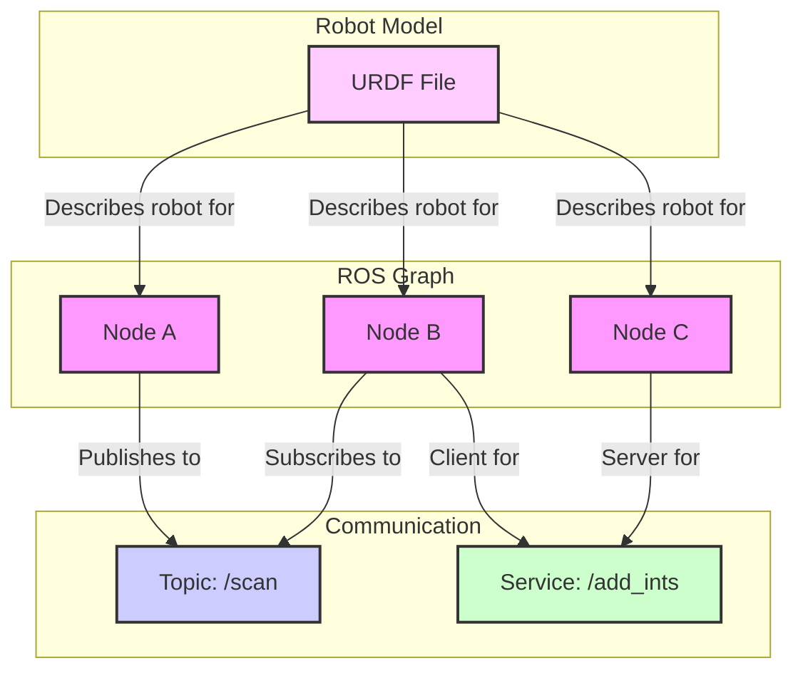

# Data Model: ROS 2 Conceptual Entities

**Created**: 2025-12-07
**Input**: `spec.md`

This document defines the core conceptual entities of the Robotic Nervous System (ROS 2) module. This is not a database schema, but rather a model of the fundamental concepts being taught.

## Entity: ROS 2 Node

A **Node** is the primary unit of computation in a ROS 2 system. It is an executable process responsible for a specific task, such as controlling a motor, processing sensor data, or planning a path.

### Attributes
-   **Name**: A unique string identifier within the ROS graph (e.g., `camera_driver`, `path_planner`).
-   **Namespace**: An optional string that prefixes the node name, allowing for grouping and avoiding name collisions (e.g., `/robot1/camera_driver`).
-   **Publishers**: A collection of objects that send messages to Topics.
-   **Subscribers**: A collection of objects that receive messages from Topics.
-   **Service Servers**: A collection of objects that provide and respond to requests.
-   **Service Clients**: A collection of objects that send requests to Services.
-   **Parameters**: A set of configurable values that can be changed at runtime.

### Relationships
-   **Communicates via**: Topics, Services, Actions, Parameters.
-   **Contained within**: A ROS 2 computational graph.

---

## Entity: ROS 2 Topic

A **Topic** is a named bus for one-way, anonymous communication. Nodes publish messages to topics, and any node subscribed to that topic will receive the messages.

### Attributes
-   **Name**: A unique string identifier within the ROS graph (e.g., `/scan`, `/cmd_vel`).
-   **Message Type**: A defined data structure that all messages on the topic must adhere to (e.g., `sensor_msgs/msg/LaserScan`).
-   **Quality of Service (QoS)**: A set of policies (e.g., reliability, durability, history depth) that define how messages are handled.

### Relationships
-   **Published by**: ROS 2 Nodes (one-to-many).
-   **Subscribed to by**: ROS 2 Nodes (many-to-many).

---

## Entity: ROS 2 Service

A **Service** provides a two-way, request/reply communication mechanism. One node acts as a server, offering the service, and another node acts as a client, making a request and waiting for a response.

### Attributes
-   **Name**: A unique string identifier within the ROS graph (e.g., `/spawn_robot`, `/reset_odometry`).
-   **Service Type**: A defined data structure consisting of a request part and a response part (e.g., `example_interfaces/srv/AddTwoInts`).
-   **Quality of Service (QoS)**: Similar to topics, defines policies for service communication.

### Relationships
-   **Provided by**: A single ROS 2 Node (the server).
-   **Used by**: One or more ROS 2 Nodes (the clients).

---

## Entity: URDF (Unified Robot Description Format)

**URDF** is an XML-based format used to describe the physical model of a robot. This includes its links, joints, sensors, and visual appearance.

### Key Elements (as attributes of the model)
-   **`<robot>`**: The root element of the model.
-   **`<link>`**: Describes a rigid body part of the robot, including its geometry, visual properties, and collision properties.
-   **`<joint>`**: Describes the kinematics and dynamics of the connection between two links.
    -   **Type**: `revolute`, `continuous`, `prismatic`, `fixed`, `floating`, `planar`.
    -   **Parent/Child**: Defines the tree structure of the robot model.
    -   **Axis**: The axis of rotation or translation.
    -   **Limits**: Defines the joint's range of motion.

### Relationships
-   **Describes**: A robot's physical structure.
-   **Used by**: Simulators (like Gazebo) and visualization tools (like RViz2) to model and display the robot.

---

## Entity Relationship Diagram (Conceptual)

